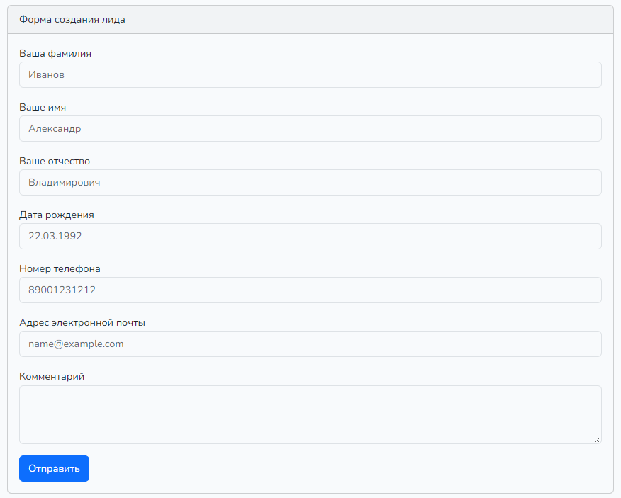
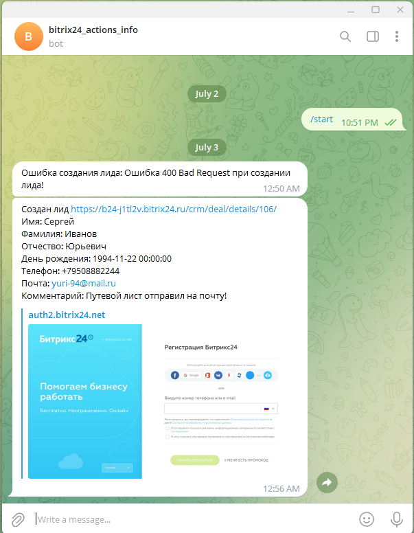

# test-integration - тестовое задание

Принцип работы данного проекта.

На главной странице проекта, созданного на базе фреймворка laravel, есть форма:



После отправки заполненной формы происходит валидация запроса и проверка на уникальность почты и телефона, после чего, 
если все проверки пройдены происходит создание лида в CRM системе Битрикс24:


Если же при создании лида произошла ошибка, телеграм бот пришлёт сообщение с кодом и типом ошибки. 
А в случае, если лид был создан в CRM-системе, информация о созданном лиде сохраняется в базе данных MySQL, тогда отправляется 
сообщение в телеграм чате с данными лида:


## Установка

**Requirements**
- Laravel
- Composer
- Vite
- Docker


**Для запуска проекта необходимо:**
- Перейти в директорию в которой, планируется работа
- Склонировать проект
```
git clone https://github.com/andrewvalentovich/todo-test.git
```

**Нужно сконфигурировать файл .env**

```
DB_CONNECTION=mysql
DB_HOST=db
DB_PORT=3306
DB_DATABASE=integration
DB_USERNAME=root
DB_PASSWORD=root
```

**Запустить Docker**

Нужно запустить десктопную версию, в случае если работа производится на ОС Windows, далее прописать:

```
docker compose up -d
```

**Установить зависимости**

Если у вас не установлен NodeJs, то его необходимо установить

```
composer install
npm install
npm run dev
```

**Установить права для директории**

Если работа производится в ОС Linux
```
sudo chmod -R 755 storage
```

**Далее необходимо сделать генерацию ключей и запустить миграции**

Для генерации ключей нужно из корневой директории прописать следующую команду:
```
php artisan key:generate
```
Нужно перейти в командную строку и из корневой директории прописать следующую команду:
```
docker exec -it test_app bash
```
После чего выполнить миграции командой
```
php artisan migrate
```
## Готово
